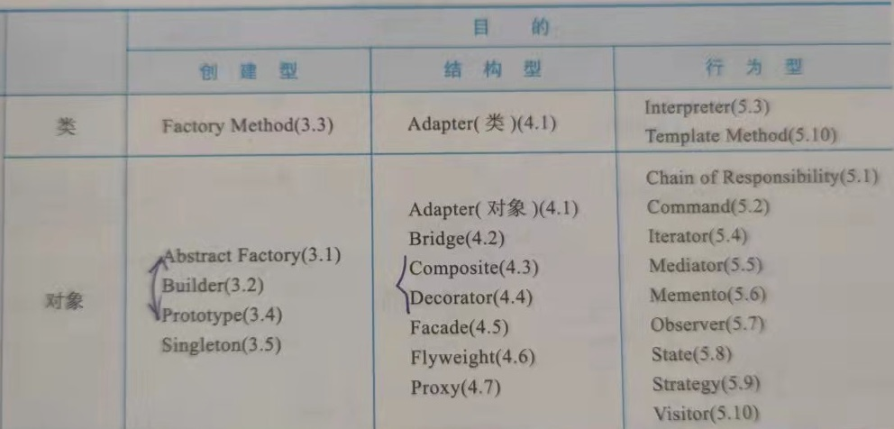

# 设计模式(Design Patterns)

## 1. 准则

## 2. 创建型 creational
1. 创建型"类模式"将对象的部分创建工作延迟到子类
2. 创建型"对象模式"将对象的部分创建工作延迟到另一个对象中
### simple Factory
> 简单工厂模式违背"开放-封闭原则"，即对扩展开放，对修改封闭。因为要添加第三个产品时，需要修改工厂类的createProduct()函数代码。

### factory method
>  定义一个创建对象的接口，让子类决定实例化哪个类。该模式使类对象的创建延迟到子类。弥补了simple factory违反的"开闭原则"。

### abstract factory
> 抽象工厂模式是生产一个"产品族(eg 水果 刀 厨房多个体系产品)"，如果产品族只有一个产品(eg:水果)，就等同于factory method,因此abstract factory是factory method的扩展。但对于增加的新的体系，需要修改工厂类的代码，即新增一个createProduct()函数，也是违反"开闭原则"的

抽象工厂模式相对于工厂方法模式来说，“每个具体工厂可以生产一族产品（即多种产品）"；而工厂方法模式是"具体工厂生产相应的具体产品，只能生产一种产品"。当产品族中只有一种产品时抽象工厂模式退化成工厂方法模式。

### Singleton 
懒汉版：只有当需要使用该实例时，才会去创建并使用实例，但需要注意"线程安全"
饿汉版：系统一运行，就初始化创建实例，当需要时，直接调用即可。这种方式本身就线程安全，没有多线程的线程安全问题。

参考：设计模式--中文版 p97
适用条件：
- 当类只能有一个实例
- 当这个唯一实例应该是通过子类化可扩展的，并且客户应该无须更改代码就能使用一个扩展的实例时

作用：
- 对唯一实例的受控访问
- 对全局变量的一种改进，避免了那些存储唯一实例的全局变量污染名字空间
- 允许对操作和表示的精化。Singleton类可以有子类，而且用这个扩展类的实例来配置一个应用是很容易的。你可以用你所需要的类的实例在运行时配置应用。
- 允许可变数目的实例。 这个模式使得你易于改变你的想法，并允许Singleton类的多个实例。此外，你可以用相同的方法来控制应用所使用的实例的数目。只允许访问singleton实例的操作需要改变

### builder

## 3. 结构型 structural
1. 结构型"类模式"使用继承机制来组合类
2. 结构型"对象模式"则描述对象的组装方式

## 4. 行为型 behavioral
1. 行为型"类模式"使用继承描述算法和控制流
2. 行为型"对象模式"描述了一组对象怎样协作完成单个对象无法完成的任务

